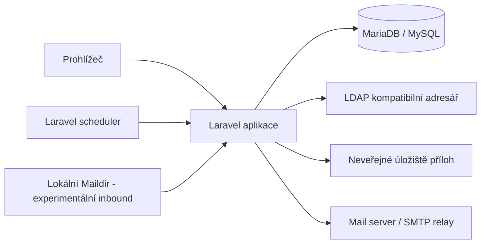
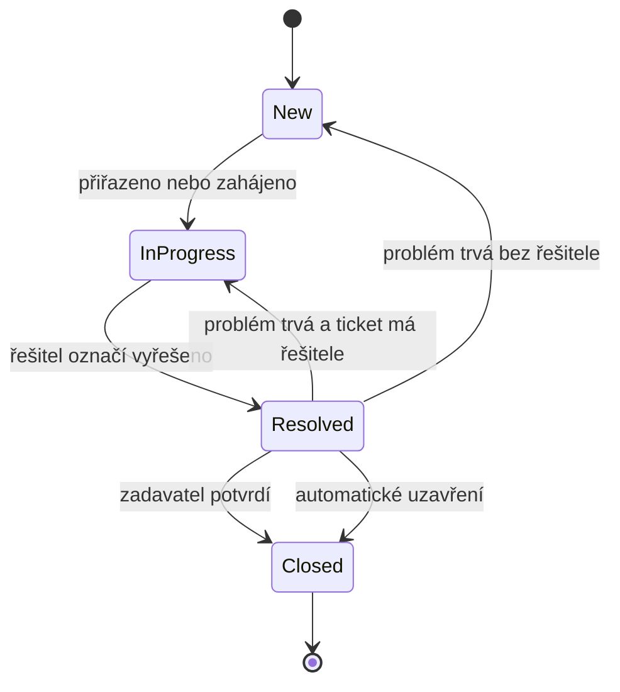
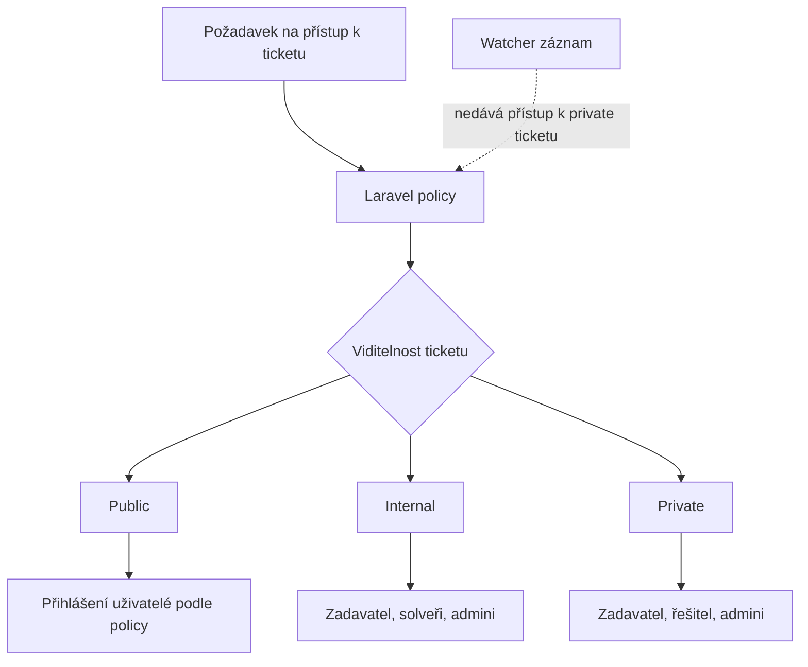
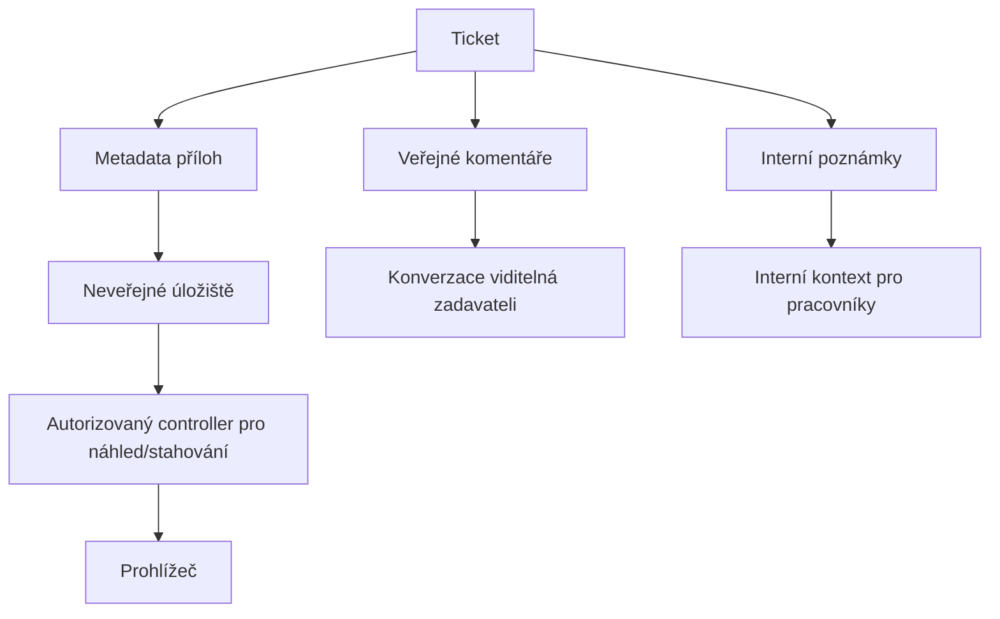

# Architektura a tok ticketu

PurelyDesk je konvenční Laravel aplikace se serverově renderovanými Blade šablonami. Používá LDAP kompatibilní autentizaci, lokální databázi pro aplikační data, chráněné úložiště příloh a volitelné e-mailové integrace.

## Vysoká úroveň architektury

Prohlížeč komunikuje s Laravel aplikací přes HTTPS. Laravel renderuje Blade view, kontroluje oprávnění přes policy, ukládá aplikační data do MariaDB/MySQL, ověřuje uživatele proti LDAP kompatibilnímu adresáři, ukládá přílohy mimo public webroot a odesílá odchozí e-maily přes Laravel mail konfiguraci.

Laravel scheduler řeší opakované příkazy, například automatické uzavření vyřešených ticketů a volitelný experimentální polling příchozího Maildiru.

## Hlavní části aplikace

- Autentizace: primární přihlášení je přes LDAP. Lokální demo login je dostupný pouze v prostředí local/testing.
- Tickety: záznamy ticketů, stav, priorita, kategorie, viditelnost, zadavatel, řešitel, sledující a historie.
- Komentáře a interní poznámky: veřejná konverzace viditelná zadavateli je oddělená od interních poznámek pro pracovníky helpdesku.
- Přílohy: metadata jsou v databázi, soubory jsou v neveřejném úložišti.
- Notifikace: odchozí e-mailové notifikace se vybírají podle typu události a filtrují přes oprávnění.
- Scheduler: opakované workflow příkazy, například automatické uzavření resolved ticketů a volitelný inbound polling.
- Dokumentace a konfigurace: veřejná dokumentace používá bezpečné placeholdery; tajné hodnoty konkrétní instalace patří do `.env`.

## Životní cyklus ticketu

Diagram ukazuje konceptuální tok ticketu. Konkrétní stavy jsou zakládány seedery a instalace je může upravit, ale obecný životní cyklus zůstává stejný.

Typický tok:

- zadavatel založí ticket;
- řešitel nebo admin ticket vytřídí;
- ticket přejde z nového nebo aktivně řešeného stavu do vyřešeno;
- zadavatel může potvrdit vyřešení nebo oznámit, že problém trvá;
- vyřešené tickety se mohou po nastavené lhůtě automaticky uzavřít.

## Role a viditelnost

PurelyDesk používá tři hlavní role:

- user/zadavatel: zakládá a sleduje vlastní tickety;
- solver/řešitel: řeší přiřazené nebo viditelné provozní tickety;
- admin: má plný administrativní přístup.

Admin přístup automaticky neznamená, že se uživatel chová jako řešitel pro dashboard a notifikace. Pokud má admin zároveň pracovat jako řešitel, má mít obě role.

| Viditelnost | Zamýšlený přístup |
|---|---|
| public | přihlášení uživatelé podle policy |
| internal | zadavatel, solveři, admini |
| private | zadavatel, řešitel, admini |

Skutečná autorizace je vynucená Laravel policies. Watcher záznam sám o sobě nesmí dát přístup k privátnímu ticketu.

## Komentáře, interní poznámky a přílohy

Veřejné komentáře jsou součástí konverzace viditelné zadavateli. Interní poznámky jsou pracovní kontext pouze pro oprávněné řešitele a adminy. Tyto dvě komunikační vrstvy musí zůstat oddělené.

Přílohy mohou patřit k ticketu nebo k veřejnému komentáři. Soubory příloh se ukládají mimo public webroot a náhled/stahování prochází přes Laravel controllery s kontrolou oprávnění.

## Tok e-mailů

Odchozí e-mailové notifikace jsou běžná funkcionalita. Laravel odesílá notifikace přes nastavený mail transport. Příjemci se vybírají podle typu události, deduplikují se a filtrují přes aktuální oprávnění ticketu. Interní poznámky neposílají běžné ticketové notifikace.

Inbound Maildir reply processing je experimentální funkcionalita ve vývoji. Zamýšlená první verze zpracovává pouze odpovědi na existující ticket notifikace a ukládá platné odpovědi jako veřejné komentáře.

Příchozí e-mail:

- nezakládá nové tickety;
- nemění stav, prioritu, řešitele, kategorii ani viditelnost;
- nepotvrzuje ani nevrací resolved workflow;
- neimportuje přílohy.

Přílohy je nutné nahrávat přes webové UI. Produkční použití inbound mailu vyžaduje end-to-end ověření mail routingu, chování MTA/Postfixu, oprávnění Maildiru a bezpečnostní gateway.

```mermaid
flowchart LR
    TicketEvent[Událost ticketu] --> NotificationService[Notification service]
    NotificationService --> PermissionFilter[Filtr oprávnění příjemců]
    PermissionFilter --> Mailer[Laravel mailer]
    Mailer --> SMTP[SMTP relay / mail server]
    SMTP --> Recipient[Příjemce]

    Recipient -. volitelná odpověď .-> Gateway[Mail gateway / routing]
    Gateway -. experimentální .-> Maildir[Lokální Maildir]
    Maildir -. scheduler polling .-> InboundProcessor[Inbound reply processor]
    InboundProcessor -. validní odpověď .-> PublicComment[Veřejný komentář ticketu]
```

Spodní inbound větev je experimentální a nemá být brána jako plně ověřená produkční cesta příjmu e-mailů bez testování v konkrétním nasazení.

## Scheduler

Laravel scheduler má v produkci běžet pravidelně. Zajišťuje opakované příkazy, například:

- automatické uzavření vyřešených ticketů po nastavené lhůtě;
- připomínky očekávaného termínu vyřešení;
- volitelný inbound Maildir polling.

Inbound polling command nic neudělá, pokud není inbound mail výslovně zapnutý. Nastavení scheduleru je odpovědnost nasazení.

## Hranice konfigurace

Aplikační konfigurace patří do `.env` a Laravel config souborů. Skutečná tajemství se nesmí commitovat.

Nasazení a serverová konfigurace zůstávají mimo aplikaci:

- web server;
- PHP-FPM;
- databázový server;
- mail server / MTA;
- firewall;
- SELinux/AppArmor nebo jiné MAC politiky;
- vlastnictví a oprávnění souborů.

Veřejná dokumentace musí používat bezpečné placeholdery a nesmí obsahovat skutečné provozní hodnoty.

## Návrhové zásady

- Jednoduchý konvenční Laravel.
- Blade šablony, žádný SPA frontend.
- Kompatibilita s MariaDB/MySQL.
- Obecná LDAP kompatibilní autentizace.
- Žádná pevná vazba na jednu organizaci nebo LDAP vendor.
- Žádné nové balíčky bez jasné potřeby.
- Striktní policy-based autorizace.
- Viditelnost public/internal/private nesmí regresovat.
- Veřejné komentáře a interní poznámky musí zůstat oddělené.
