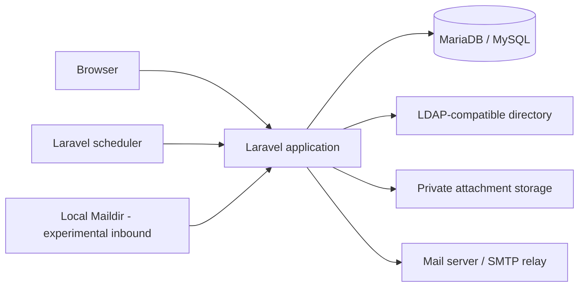
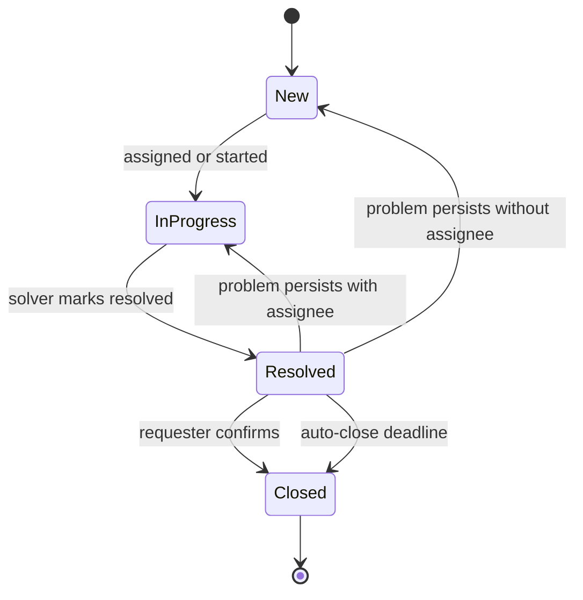
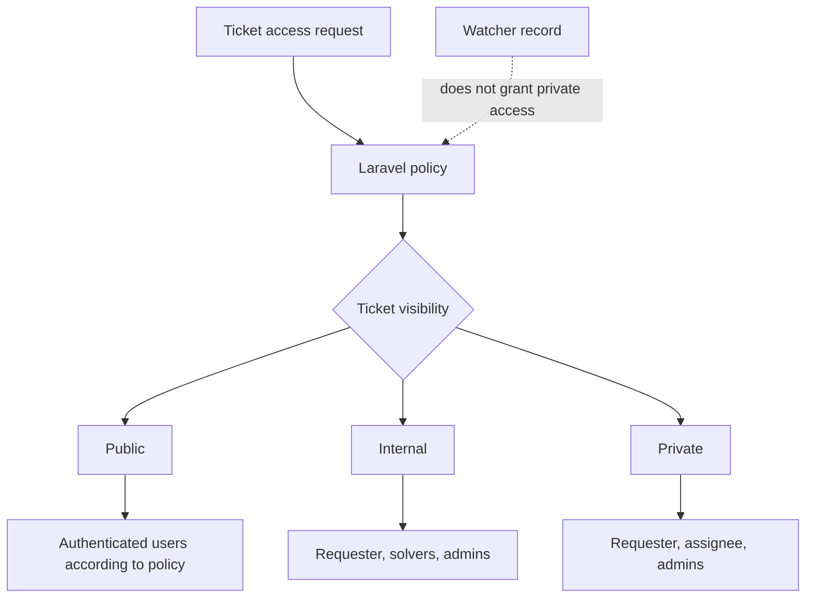
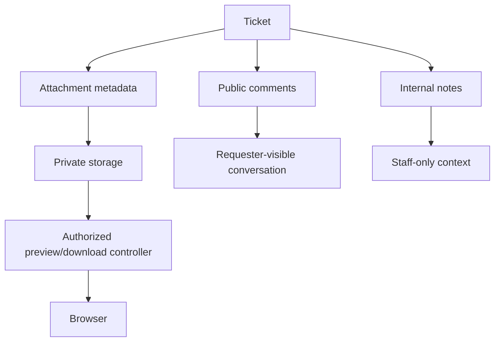

# Architecture and Ticket Flow

PurelyDesk is a conventional Laravel application with server-rendered Blade views. It uses LDAP-compatible authentication, a local database for application data, protected attachment storage, and optional mail integrations.

## High-Level Architecture

The browser communicates with the Laravel application over HTTPS. Laravel renders Blade views, checks authorization through policies, stores application data in MariaDB/MySQL, authenticates users against an LDAP-compatible directory, stores attachment files outside the public webroot, and sends outgoing e-mail through Laravel's mail configuration.

The Laravel scheduler handles recurring commands such as automatic closing of resolved tickets and optional experimental inbound Maildir polling.

## Main Application Areas

- Authentication: LDAP login is the primary authentication mode. A local demo login is available only in local/testing environments.
- Tickets: ticket records, status, priority, category, visibility, requester, assignee, watchers, and history.
- Comments and internal notes: requester-visible public conversation is separated from staff-only internal notes.
- Attachments: metadata is stored in the database, while files are stored in private storage.
- Notifications: outgoing e-mail notifications are selected by event type and filtered through permissions.
- Scheduler: recurring workflow commands such as resolved-ticket auto-close and optional inbound polling.
- Documentation and configuration: public documentation uses safe placeholders; deployment-specific secrets belong in `.env`.

## Ticket Lifecycle

This diagram shows the conceptual flow of a ticket. Concrete status records are seeded by the application and can be adjusted by a deployment, but the general lifecycle remains the same.

Typical flow:

- a requester creates a ticket;
- a solver or admin triages it;
- the ticket moves from new or active work into resolved;
- the requester can confirm the resolution or report that the problem persists;
- resolved tickets can be closed automatically after a configured grace period.

## Roles and Visibility

PurelyDesk uses three main roles:

- user/requester: creates and follows their own tickets;
- solver: handles assigned or visible operational tickets;
- admin: has full administrative access.

Admin access does not automatically make a user a solver for dashboard and notification behavior. If an administrator should also work as a solver, the account should have both roles.

| Visibility | Intended access |
|---|---|
| public | authenticated users according to policy |
| internal | requester, solvers, admins |
| private | requester, assignee, admins |

Actual authorization is enforced by Laravel policies. A watcher record must not grant access to a private ticket by itself.

## Comments, Internal Notes, and Attachments

Public comments are part of the requester-visible conversation. Internal notes are staff-only context for authorized solvers and admins. These two communication streams must remain separate.

Attachments can belong to tickets or public comments. Attachment files are stored outside the public webroot, and preview/download actions go through Laravel controllers with authorization checks.

## E-mail Flow

Outgoing e-mail notifications are normal functionality. Laravel sends notifications through the configured mail transport. Recipients are selected by event type, deduplicated, and filtered through current ticket permissions. Internal notes do not send regular ticket notifications.

Inbound Maildir reply processing is experimental and under development. The intended first version only processes replies to existing ticket notifications and stores valid replies as public comments.

Inbound e-mail does not:

- create new tickets;
- change status, priority, assignee, category, or visibility;
- confirm or reject resolved-ticket workflow;
- import attachments.

Attachments must be uploaded through the web UI. Production inbound use requires end-to-end validation of mail routing, MTA/Postfix behavior, Maildir permissions, and security gateway behavior.

```mermaid
flowchart LR
    TicketEvent[Ticket event] --> NotificationService[Notification service]
    NotificationService --> PermissionFilter[Recipient permission filtering]
    PermissionFilter --> Mailer[Laravel mailer]
    Mailer --> SMTP[SMTP relay / mail server]
    SMTP --> Recipient[Recipient]

    Recipient -. optional reply .-> Gateway[Mail gateway / routing]
    Gateway -. experimental .-> Maildir[Local Maildir]
    Maildir -. scheduler polling .-> InboundProcessor[Inbound reply processor]
    InboundProcessor -. valid reply .-> PublicComment[Public ticket comment]
```

The lower inbound branch is experimental and should not be treated as a fully verified production mail intake path without deployment-specific testing.

## Scheduler

The Laravel scheduler should run regularly in production. It handles recurring commands such as:

- automatic closing of resolved tickets after their configured grace period;
- expected resolution deadline reminders;
- optional inbound Maildir polling.

The inbound polling command does nothing unless inbound mail is explicitly enabled. Scheduler setup is a deployment responsibility.

## Configuration Boundaries

Application configuration belongs in `.env` and Laravel config files. Real secrets must not be committed.

Deployment and server configuration remain outside the application:

- web server;
- PHP-FPM;
- database server;
- mail server / MTA;
- firewall;
- SELinux/AppArmor or other MAC policies;
- filesystem ownership and permissions.

Public documentation must use safe placeholders and must not include real infrastructure values.

## Design Principles

- Simple conventional Laravel.
- Blade templates, no SPA frontend.
- MariaDB/MySQL compatibility.
- Generic LDAP-compatible authentication.
- No hard dependency on one organization or LDAP vendor.
- No new packages without clear need.
- Strict policy-based authorization.
- Public/internal/private visibility must not regress.
- Public comments and internal notes must stay separate.
